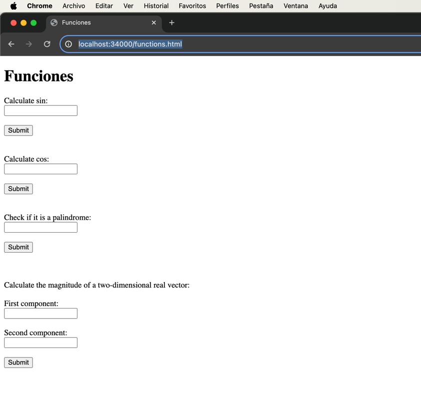

# TALLER DE DE MODULARIZACIÓN CON VIRTUALIZACIÓN E INTRODUCCIÓN A DOCKER
A continuación, se construirá una aplicación web pequeña usando el micro-framework de Spark java. Luego, se procederá a construir un contenedor en docker para la aplicación, el cual será desplegado y configurado en nuestra máquina local. Finalmente, crearemos un repositorio en DockerHub y subiremos la imagen al repositorio, para que esta pueda ser usada por otros, y se pueda ejecutar la aplicación.

## Autor
* **Juan Felipe Sánchez Pérez**

## Instalación y ejecución
### Prerequisitos

* Versión de Java: 8.

### Instalación y uso
1. Abra la consola o la línea de comandos, y vaya a la carpeta raíz del proyecto _Lab05-AREP_. Una vez allí, ejecute el comando que se muestra a continuación, para traer la imagen que se usará para ejecutar la aplicación:  
```
docker pull juansanxz/dockerprimer:latest
```  
En docker, en la sección de imágenes, se observa la que se descargó recientemente:  

2. Posteriormente, use el siguiente comando para crear un contenedor que tendrá la imagen traída anteriormente:
```
docker run -d -p 34000:46000 --name dockerfuncionesapp juansanxz/dockerprimer
```  
En la siguiente imagen, se evidencia en docker, en la sección de contenedores, que fue creado exitosamente:  
    
3. Como se observó en la imagen anterior, el contenedor está corriendo, y podremos probar la aplicación web. Para ello, diríjase a un broswer (en este caso se hará con chrome) e ingrese a la siguiente URL `http://localhost:34000/functions.html`, donde verá lo siguiente:  
  
4. Aquí podrá calcular el seno y coseno de cualquier ángulo (dado en radianes):

5. Puede determinar si una palabra es o no un palíndromo:  
  
  
6. Finalmente puede calcular la magnitud de un vector real de dos dimensiones:  
  

## Decisiones de diseño
La arquitectura que se diseñó e implementó para este laboratorio está compuesta por una aplicación web que usa el micro-framework de Spark para atender solicitudes Http.
* Se atendieron en tal aplicación las solicitudes indicadas en el enunciado, para resolver las operaciones de:
  * Sin(angle).
  * Cos(angle).
  * Determinar si una cadena es un palíndromo.
  * Determinar la magnitud de un vector real de dos dimensiones.
* Una vez construida y configurada adecuadamente la aplicación web, se creó la imagen que se usó en el contenedor y se creó una referencia a esa imagen para subirla al repositorio, permitiendo que otros la descarguen para la creación de un contenedor y la ejecución de la aplicación.

## Build
* Maven - Administración de dependencias

## Versión
1.0


